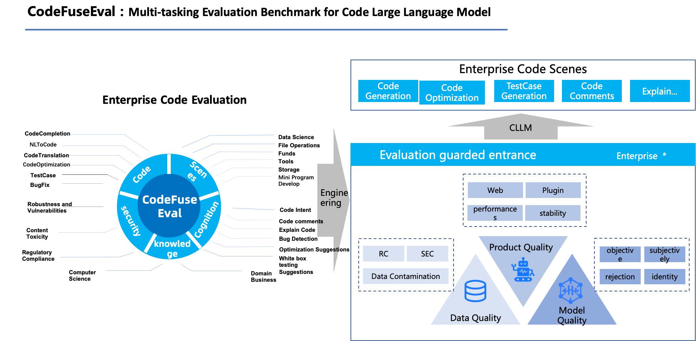

# CodeFuseEval: Multi-tasking Evaluation Benchmark for Code Large Language Model

<p align="center">
  
</p>
CodeFuseEval is a Code Generation benchmark that combines the multi-tasking scenarios of CodeFuse Model with the benchmarks of HumanEval-x and MBPP. This benchmark is designed to evaluate the performance of models in various multi-tasking tasks, including code completion, code generation from natural language, test case generation, cross-language code translation, and code generation from Chinese commands, among others.Continuously open, stay tuned !


🌐 <a href="README_CN.md" target="_blank">中文</a>



## Generation environment：
CodeFuse-13B: Python 3.8 or above,PyTorch 1.12 or above, with a recommendation for 2.0 or above, Transformers 4.24.0 or above ,CUDA 11.4 or above (for GPU users and flash-attention users, this option should be considered).

CodeFuse-CodeLlama-34B:python>=3.8,pytorch>=2.0.0,transformers==4.32.0,Sentencepiece,CUDA 11.

### Generation Processor：
We designed an infrastructure called Processor. Its main purpose is to handle the differences between different models. It mainly needs to complete three abstract functions:
*   ``load_model_tokenizer``:Due to differences in model loading parameters and tokenizer terminators, models need to use different parameters for adaptation and loading. The current function is mainly to help users load and adapt different models.
*   ``process_before``: Since prompt adapts to different prompt styles according to different types of evaluation tasks or different models selected by users, the 「process_before」function is extracted mainly to help users process prompts.
*   ``process_after``:Due to the diversity of model generation results, in order to adapt to the evaluation framework, the generated result data can be spliced into appropriate use cases for automated operation. The current function mainly processes the generated results to adapt to the evaluation data set and results based on the task type and data set conditions.


We also modified the relevant configuration of ckpt_config to save the evaluation. For example: 
```commandline
{
  "CodeFuse-13B": {
    "path": "/mnt/user/294761/bigcode/CodeFuse13B-evol-instruction-4K/", // model path
    "processor_class": "codefuseEval.process.codefuse13b.Codefuse13BProcessor", // processor path (please create file in "codefuseEval.process")
    "tokenizer": {
      "truncation": true,
      "padding": true,
      "max_length": 600
    },                           // params for tokenizer to encode input prompts 
    "generation_config": {       // generation_config, you can combine 「decode_mode」 param set your own decode, please use jsonObject to set different decodemode. Non-JsonObject data will be read directly into generation config 
      "greedy": {
        "do_sample": false,
        "num_beams": 1,
        "max_new_tokens": 512
      },
      "beams": {
        "do_sample": false,
        "num_beams": 5,
        "max_new_tokens": 600,
        "num_return_sequences": 1
      },
      "dosample": {
        "do_sample": true
      },
      "temperature": 0.2,
      "max_new_tokens": 600,
      "num_return_sequences": 1,
      "top_p": 0.9,
      "num_beams": 1,
      "do_sample": true
    },
    "task_mode": "code_completion",//current support [code_completion,nl2code,code_trans,codescience] four kinds, if you eval_dataset support many task, suggest you set task mode to get suitable process
    "batch_size": 1,
    "sample_num": 1,
    "decode_mode": "beams" //decode_mode, The configuration of the corresponding decoding mode will be set to the generation config.
  }
```

## Generation Comand：

```
bash codefuseEval/script/generation.sh MODELNAME EVALDATASET OUTFILE LANGUAGE

eg:
bash codefuseEval/script/generation.sh CodeFuse-13B humaneval_python result/test.jsonl python
```

if you want to test code translation, the language is source language. For Example:
if you want test the cpp code translate into python

```bash
bash codefuseEval/script/generation.sh CodeFuse-CodeLlama-34B codeTrans_cpp_to_python result/test.jsonl cpp
```


## How to use CodeFuseEval

### Evaluation Data
Data are stored in ``codefuseEval/data``, using JSON list format. We first integrated humaneval-X dataset.

*   ``task_id``: indicates the target language and ID of the problem. Language is one of ["Python", "Java", "JavaScript", "CPP", "Go"].
*   ``prompt``: the function declaration and docstring, used for code generation.
*   ``declaration``: only the function declaration, used for code translation. 
*   ``canonical_solution``: human-crafted example solutions.
*   ``test``: hidden test samples, used for evaluation
*   ``example_test``: public test samples (appeared in prompt), used for evaluation. 
*   ``prompt_text``: prompt text
*   ``prompt_explain``: prompt explanation
*   ``func_title``: code function title 
*   ``prompt_text_chinese``: Chinese prompt

### Evaluation Environment

The evaluation of the generated codes involves compiling and running in multiple programming languages. The versions of the programming language environments and packages we use are as follows:

| Dependency | Version  |
| ---------- |----------|
| Python     | 3.10.9   |
| JDK        | 18.0.2.1 |
| Node.js    | 16.14.0  |
| js-md5     | 0.7.3    |
| C++        | 11       |
| g++        | 7.5.0    |
| Boost      | 1.75.0   |
| OpenSSL    | 3.0.0    |
| go         | 1.18.4   |
| cargo      | 1.71.1   |

In order to save everyone the trouble of setting up the environments for these languages, we create a Docker image with the required environments and codefuseEval.
```bash
docker pull registry.cn-hangzhou.aliyuncs.com/codefuse/codefuseeval:latest
```

If you are familiar with docker, you can build the image from `codefuseEval/docker/Dockerfile` or configure the Dockerfile as you like it:

```bash
cd codefuseEval/docker
docker build [OPTIONS] .
```

After obtaining the image, you can build a container using the following command:

```bash
docker run -it --gpus all --mount type=bind,source=<LOCAL PATH>,target=<PATH IN CONTAINER> [OPTIONS] <IMAGE NAME:TAG>
```

### Evaluation Metrics
In addition to the unbiased pass@k indicators currently provided in [Codex](https://arxiv.org/abs/2107.03374), we will also integrate the relevant indicators of huggingface open source with [CodeBLEU](https://arxiv.org/abs/2009.10297) for integration.
The main indicators currently recommended for users are as follows:
*   ``codebleu``
*   ``pass@k``
*   ``bleu``
*   ``bleurt``

For other related metrics, you can check the code of the metric or the evaluation code to meet your requirements.

### Evaluation

We recommend evaluating in [the provided image](#evaluation-environment). To evaluate the generated samples, save generated codes in the following JSON list format:

```
{"task_id": "../..", "generation: "..."}
{"task_id": "../..", "generation: "..."}
...
```

and evaluate them using the following script under the root directory of the repository (<font color='red'>please execute with caution, the generated codes might have unexpected behaviours though with very low possibility. See the warnings in [execution.py](execution.py) and uncomment the execution lines at your own risk</font>):

```
bash codefuseEval/script/evaluation.sh <RESULT_FILE> <METRIC> <PROBLEM_FILE> <TEST_GROUDTRUTH>
eg: 
bash codefuseEval/script/evaluation.sh codefuseEval/result/test.jsonl pass@k humaneval_python
```

At the same time, we currently provide the following flags, which can directly bring the sample answers in the test data set as generated answers for testing.

* ``TEST_GROUDTRUTH`` default False

When TEST_GROUDTRUTH is True, the self-test mode is turned on, PROBLEM_FILE will be read, and the sample answer will be substituted as the generated answer for testing.

When TEST_GROUDTRUTH is False, open the evaluation mode, read RESULT_FILE and PROBLEM_FILE, and substitute the generated answer for testing.

# Check result Command：
We provide the script to check the result for provided code LLMs. Please use following scripts to check corresponding results and the environment .

```bash
bash codefuseEval/script/check_reference.sh codefuseEval/result/CodeFuse-CodeLlama-34B/humaneval_result_python.jsonl humaneval_python
bash codefuseEval/script/check_reference.sh codefuseEval/result/CodeFuse-13B/humaneval_result_python.jsonl humaneval_python 

```

# Check dataset Command：
CodeCompletion
```bash
bash codefuseEval/script/check_dataset.sh humaneval_python

bash codefuseEval/script/check_dataset.sh humaneval_java

bash codefuseEval/script/check_dataset.sh humaneval_js

bash codefuseEval/script/check_dataset.sh humaneval_rust

bash codefuseEval/script/check_dataset.sh humaneval_go

bash codefuseEval/script/check_dataset.sh humaneval_cpp
```
NL2Code
```bash
bash codefuseEval/script/check_dataset.sh mbpp
```
CodeTrans
```
bash codefuseEval/script/check_dataset.sh codeTrans_python_to_java

bash codefuseEval/script/check_dataset.sh codeTrans_python_to_cpp

bash codefuseEval/script/check_dataset.sh codeTrans_cpp_to_java

bash codefuseEval/script/check_dataset.sh codeTrans_cpp_to_python

bash codefuseEval/script/check_dataset.sh codeTrans_java_to_python

bash codefuseEval/script/check_dataset.sh codeTrans_java_to_cpp
```
CodeScience
```
bash codefuseEval/script/check_dataset.sh codeCompletion_matplotlib

bash codefuseEval/script/check_dataset.sh codeCompletion_numpy

bash codefuseEval/script/check_dataset.sh codeCompletion_pandas

bash codefuseEval/script/check_dataset.sh codeCompletion_pytorch

bash codefuseEval/script/check_dataset.sh codeCompletion_scipy

bash codefuseEval/script/check_dataset.sh codeCompletion_sklearn

bash codefuseEval/script/check_dataset.sh codeCompletion_tensorflow

bash codefuseEval/script/check_dataset.sh codeInsertion_matplotlib

bash codefuseEval/script/check_dataset.sh codeInsertion_numpy

bash codefuseEval/script/check_dataset.sh codeInsertion_pandas

bash codefuseEval/script/check_dataset.sh codeInsertion_pytorch

bash codefuseEval/script/check_dataset.sh codeInsertion_scipy

bash codefuseEval/script/check_dataset.sh codeInsertion_sklearn

bash codefuseEval/script/check_dataset.sh codeInsertion_tensorflow
```


