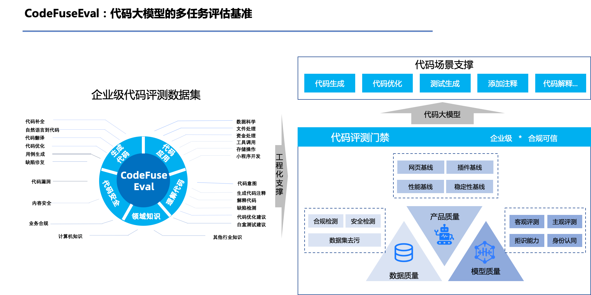

# CodeFuseEval: 代码大语言模型的多任务评估基准

<p align="center">
  
</p>
CodeFuseEval在HumanEval-x、MBPP的基准上，结合CodeFuse大模型多任务场景，开发的编程领域多任务的评测基准， 可用于评估模型在代码补全，自然语言生成代码，测试用例生成、跨语言代码翻译，中文指令生成代码等多类任务的性能。持续开放中，敬请期待！

🌐 <a href="README.md" target="_blank">English</a>



## 推理环境：
CodeFuse-13B: python 3.8及以上版本，pytorch 2.0及以上版本，transformers 4.24.0及以上版本，CUDA 11.4及以上；

CodeFuse-CodeLlama-34B: python 3.8及以上版本，pytorch2.0及以上版本，transformers==4.32.0 ，Sentencepiece，CUDA 11.4及以上。

### 处理器：

我们设计了一个名为Processor的基础结构，用户可以自己根据推理模型的情况创建自己需要的处理器, 主要目的是为了处理不同模型的区别情况进行处理，主要需要完成3个抽象函数：
```
load_model_tokenizer: 由于模型加载参数的区别以及tokenizer的终止符的区别，模型需要使用不同的参数进行适配加载，当前函数主要是为了帮助用户加载适配不同的模型
process_before：由于prompt根据用户不同的选择评测任务的类型或不同模型来适配不同的prompt样式，因此抽取出process_before函数主要用来帮助用户处理prompt
process_after：由于模型生成结果多样性，为了适配评测框架，方便生成结果数据可以拼接成合适的用例进行自动化运行，当前函数主要是根据任务类型和数据集情况，处理生成结果适配评测数据集和结果进行评测
```

为了支持处理器结构，我们同时修改了ckpt_config保存评测的相关配置。例如: 
```commandline
{
  "CodeFuse-13B": {
    "path": "/mnt/model/CodeFuse13B-evol-instruction-4K/", // 模型路径
    "processor_class": "codefuseEval.process.codefuse13b.Codefuse13BProcessor", // 处理器路径 (请把处理器类文件放在codefuseEval/process/下,否则会读取失败)
    "dataset": "humaneval_python", // 评测数据集
    "language": "python",
    "tokenizer": {
      "truncation": true,
      "padding": true,
      "max_length": 600
    },                           // 用于token化prompt的tokenizer参数
    "generation_config": {       // 生成配置，你可以结合下面的「decode_mode」参数设置自己的解码策略，请使用json对象设置不同解码配置，非json对象会直接读取到默认生成配置中
      "greedy": {
        "do_sample": false,
        "num_beams": 1,
        "max_new_tokens": 512
      },
      "beams": {
        "do_sample": false,
        "num_beams": 5,
        "max_new_tokens": 600,
        "num_return_sequences": 1
      },
      "dosample": {
        "do_sample": true
      },
      "temperature": 0.2,
      "max_new_tokens": 600,
      "num_return_sequences": 1,
      "top_p": 0.9,
      "num_beams": 1,
      "do_sample": true
    },
    "task_mode": "code_completion",//目前支持 [code_completion,nl2code,code_trans,codescience] 4种任务类型，如果你评测的数据集支持多个task_mode,建议你设置task_mode来获取合适的任务处理方式
    "batch_size": 1,
    "sample_num": 1,
    "decode_mode": "beams" //解码策略，对应的解码策略的配置会设置到生成配置中
  }
```

## 推理命令：

```
bash codefuseEval/script/generation.sh MODELNAME EVALDATASET OUTFILE LANGUAGE
eg:
bash codefuseEval/script/generation.sh CodeFuse-13B humaneval_python result/test.jsonl python
```
如果你想进行代码翻译评测，传入的语言参数为当前待翻译的代码语言，例如：
如果你想将C++代码翻译为Python代码，传入代码语言为CPP，如

```bash
bash codefuseEval/script/generation.sh CodeFuse-CodeLlama-34B codeTrans_cpp_to_python result/test.jsonl cpp
```

## 如何使用CodeFuseEval

### 评测数据集
样本使用JSON列表格式存储在``codefuseEval/data``中,根据用户所需的下游任务情况，每条样本包含

*   ``task_id``: 题目的目标语言与ID。语言为["Python", "Java", "JavaScript", "CPP", "Go"]中之一。
*   ``prompt``: 函数声明与描述，用于代码生成。
*   ``declaration``: 仅有函数声明，用于代码翻译。
*   ``canonical_solution``: 手写的示例解答。
*   ``test``: 隐藏测例，用于评测。
*   ``example_test``: 公共测试样本，用于评估生成代码。
*   ``prompt_text``: prompt文本情况。
*   ``prompt_explain``: prompt信息说明。
*   ``func_title``: 生成函数头信息。
*   ``prompt_text_chinese``: 中文prompt信息。

### 评测执行环境

评测生成的代码需要使用多种语言编译、运行。我们使用的各编程语言依赖及所用包的版本如下：

| 依赖    | 版本       |
| ------- |----------|
| Python  | 3.10.9   |
| JDK     | 18.0.2.1 |
| Node.js | 16.14.0  |
| js-md5  | 0.7.3    |
| C++     | 11       |
| g++     | 7.5.0    |
| Boost   | 1.75.0   |
| OpenSSL | 3.0.0    |
| go      | 1.18.4   |
| cargo   | 1.71.1   |


为了省去使用者配置这些语言环境的麻烦，我们构建了一个Docker镜像，并在其中配置了所需要的环境，你可以按照下面的指令拉取使用
```bash
docker pull registry.cn-hangzhou.aliyuncs.com/codefuse/codefuseeval:latest
```

如果您熟悉Dockerfile，也可以从`codefuseEval/docker/Dockerfile`构建镜像，或者修改之以定制自己的配置：

```bash
cd codefuseEval/docker
docker build [OPTIONS] .
```

获取镜像后，使用如下命令创建容器：

```bash
docker run -it --gpus all --mount type=bind,source=<LOCAL PATH>,target=<PATH IN CONTAINER> [OPTIONS] <IMAGE NAME:TAG>
```

### 评测指标
除了目前提供的[Codex](https://arxiv.org/abs/2107.03374) 中提出的无偏 pass@k 指标之外，我们还将huggingface开源的相关指标与[CodeBLEU](https://arxiv.org/abs/2009.10297)提出的相似性指标进行集成。
目前建议用户主要使用的指标如下：
*   ``codebleu``: codebleu相似性评测指标。
*   ``pass@k``: 无偏pass@k的评测指标。
*   ``bleu``: 文本相似性指标bleu
*   ``bleurt``: 文本语义相似性指标bleurt

其它的相关指标情况用户可以查看metric的使用情况与代码情况进行调整使用。

### 评测

我们推荐使用给定的[评测环境](#评测环境)进行评测。在评测前，将生成的代码以如下JSON列表形式存储：

```
{"task_id": "../..", "generation: "..."}
{"task_id": "../..", "generation: "..."}
...
```

### 评测命令：
```
bash codefuseEval/script/evaluation.sh <RESULT_FILE> <METRIC> <PROBLEM_FILE> <TEST_GROUDTRUTH>
eg: 
bash codefuseEval/script/evaluation.sh codefuseEval/result/test.jsonl pass@k humaneval_python 
```

并在本仓库的根目录下使用如下指令（<font color='red'>请谨慎执行，生成的代码可能有极低概率产生意外行为。在[execution.py](execution.py)中查看警告并取消执行代码的注释，风险自负</font>）：

同时我们当前提供如下的标志位，可以直接将测试数据集中的示例解答作为生成答案带入进行测试。
* ``TEST_GROUDTRUTH`` 取值为True或False

当TEST_GROUDTRUTH为True时，开启self-test模式，将读取PROBLEM_FILE，将示例解答作为生成答案代入进行测试。
TEST_GROUDTRUTH为False时，开启评测模式，读取RESULT_FILE和将读取PROBLEM_FILE，将生成答案代入进行测试

# 检查推理结果指令
我们提供脚本来检查所提供代码 LLM 的结果。请使用以下脚本检查相应的推理结果。
```
bash codefuseEval/script/check_reference.sh codefuseEval/result/CodeFuse-CodeLlama-34B/humaneval_result_python.jsonl humaneval_python
bash codefuseEval/script/check_reference.sh codefuseEval/result/CodeFuse-13B/humaneval_result_python.jsonl humaneval_python 
```

# 检查数据集及环境：
代码补全
```bash
bash codefuseEval/script/check_dataset.sh humaneval_python

bash codefuseEval/script/check_dataset.sh humaneval_java

bash codefuseEval/script/check_dataset.sh humaneval_js

bash codefuseEval/script/check_dataset.sh humaneval_rust

bash codefuseEval/script/check_dataset.sh humaneval_go

bash codefuseEval/script/check_dataset.sh humaneval_cpp
```
自然语言生成代码
```bash
bash codefuseEval/script/check_dataset.sh mbpp
```
代码翻译
```
bash codefuseEval/script/check_dataset.sh codeTrans_python_to_java

bash codefuseEval/script/check_dataset.sh codeTrans_python_to_cpp

bash codefuseEval/script/check_dataset.sh codeTrans_cpp_to_java

bash codefuseEval/script/check_dataset.sh codeTrans_cpp_to_python

bash codefuseEval/script/check_dataset.sh codeTrans_java_to_python

bash codefuseEval/script/check_dataset.sh codeTrans_java_to_cpp
```
科学计算
```
bash codefuseEval/script/check_dataset.sh codeCompletion_matplotlib

bash codefuseEval/script/check_dataset.sh codeCompletion_numpy

bash codefuseEval/script/check_dataset.sh codeCompletion_pandas

bash codefuseEval/script/check_dataset.sh codeCompletion_pytorch

bash codefuseEval/script/check_dataset.sh codeCompletion_scipy

bash codefuseEval/script/check_dataset.sh codeCompletion_sklearn

bash codefuseEval/script/check_dataset.sh codeCompletion_tensorflow

bash codefuseEval/script/check_dataset.sh codeInsertion_matplotlib

bash codefuseEval/script/check_dataset.sh codeInsertion_numpy

bash codefuseEval/script/check_dataset.sh codeInsertion_pandas

bash codefuseEval/script/check_dataset.sh codeInsertion_pytorch

bash codefuseEval/script/check_dataset.sh codeInsertion_scipy

bash codefuseEval/script/check_dataset.sh codeInsertion_sklearn

bash codefuseEval/script/check_dataset.sh codeInsertion_tensorflow
```